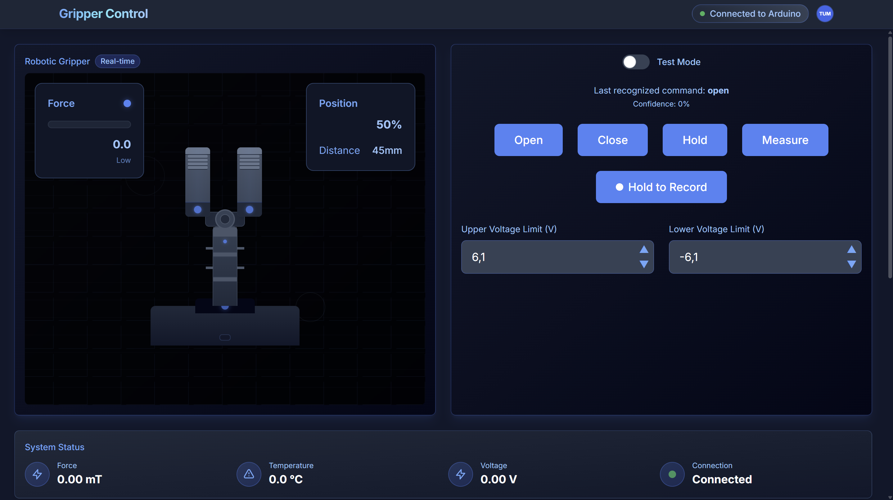

# Smart Gripper Project - Team 2r1p - TUM 🤖


"Do. Or do not. There is no try." - **Master Yoda**
> **Disclaimer:**  
> This was a hackathon project, so the code is rushed.  
> *(Star Wars theme to match the jury's humor.)*

## Project Overview - Hello There!
Our team has developed an advanced smart gripper system that combines precise control, real-time feedback, and intelligent object handling capabilities. The system features a modern web-based interface with voice control, real-time data visualization, and adaptive control strategies.

## Key Features

### 1. Intelligent Control System
- **Adaptive Force Control**: Dynamic adjustment of grip force based on object properties like size
- **Real-time Sensor Feedback**: Continuous monitoring using 3D magnetic sensors
- **Smart Object Detection**: Automatic detection of object properties (size, shape)
- **Voice Control Integration**: Natural language command interface

### 2. Advanced User Interface
- **Real-time Visualization**: Live monitoring of force, position, and sensor data
- **Interactive Controls**: Intuitive button and voice command interface
- **Data Analytics**: Comprehensive data logging and analysis tools
- **Responsive Design**: Modern, user-friendly web interface

### 3. Technical Innovations

#### Control System
- **Adaptive PID Control**: A optional PID-control for a constant force grip
- **Force Feedback Loop**: Real-time adjustment using magnetic sensor data
- **Smart Grip Strategy**: 
  - Gripping: torque control + smart object detection to switch from closing to hold
  - Gentle handling of fragile objects
  - Adaptive response to object shape
  - Opening: positional control to open and stop before disengaging gears

#### Hardware Integration
- **Sensor Fusion**: Integration of multiple magnetic sensors for precise feedback
- **Motor Control**: Optimized BLDC motor control with voltage and current monitoring and a variety of control strategies
- **Safety Features**: Automatic limit detection for closing and opening to prevent motor overheating or disengaging of gears

## Technical Implementation

### Hardware Stack
- **Main Controller**: Infineon XMC4700 Relax Kit
- **Sensors**: 
  - TLE5012 for position sensing
  - TLx493D for force and object detection
- **Actuators**: BLDC motor with integrated position feedback

### Software Architecture
- **Frontend**: React-based web interface (also supporting different platforms like Windows and Linux)
- **Backend**: Python server with WebSocket support
- **Firmware**: Custom Arduino implementation
- **Communication**: 
  - WebSocket for real-time data
  - Serial protocol for hardware control

### Control Algorithms
1. **PID Tuning System**
   - self tuning by user dependend on hardware condition

2. **Smart Control Strategy**
   - Object property detection (size)
   - Material classification (in future based on force change over time)
   - Force profile optimization (in future)
  


## Development Process

### Day 1: Hardware and Basic Control
- Initial hardware setup and calibration
- Motor parameter optimization
- Basic grip functionality implementation
- Hardware stability improvements

### Day 2: Software Integration
- Web interface development
- Real-time data visualization
- Voice control implementation
- Communication protocol design
- restructuring of the code

## Future Improvements
1. **Enhanced Control**
   - Advanced PID auto-tuning
   - Machine learning-based parameter optimization
   - Temperature monitoring and compensation

2. **Object Detection**
   - Improved material classification
   - Shape recognition
   - Adaptive grip force profiles

3. **User Interface**
   - Advanced calibration tools
   - Diagnostic features
   - Performance analytics

## Technical Challenges and Solutions

### Challenge 1: Control Tuning
- **Problem**: Manual PID tuning for BLDC motors is complex and time-consuming + parameters are dependend on hardware condition
- **Solution**: 
  - Developed alternative adaptive control strategies
  - Created real-time performance monitoring

### Challenge 2: Smart Control
- **Problem**: Need for intelligent, adaptive control beyond basic PID
- **Solution**:
  - Implemented dynamic force adjustment
  - Developed object property detection
  - Created smart grip and release strategies


## Getting Started

### Prerequisites
- Python 3.8+
- Node.js 14+
- Arduino IDE
- Required hardware components

### Installation
1. Clone the repository
2. Install backend dependencies:
   ```bash
   pip install -r requirements.txt
   ```
3. Install frontend dependencies:
   ```bash
   cd frontend
   npm install
   ```
4. Upload firmware to Arduino
5. Start the backend server
   ```bash
   python server.py
   ```
7. Launch the frontend application
      ```bash
   npm run dev
   ```
## Frontend Showcase



## Contributing
We welcome contributions to improve the project. Please read our contributing guidelines for details.

## License
This project is licensed under the MIT License - see the LICENSE file for details.

## Acknowledgments
- The Infineon crew for their guidance and support, may the force be with you!
- Special thanks to R2‑D2 for compliant beep‑boop translations.


